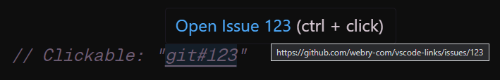
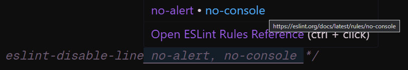
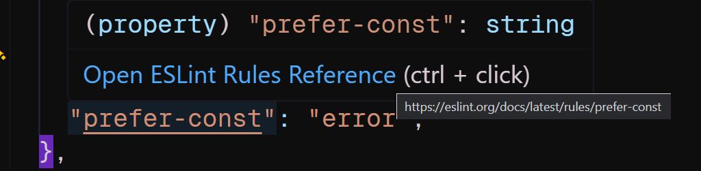
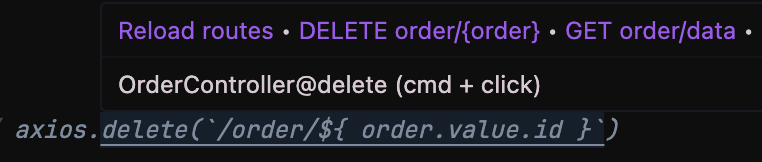

# Examples

::: details Git Issues
Here is an example of how you can link to a git issue.


```js
// EXAMPLE LINKS:
// git#123

export default {
  links: [
    {
      include: "*.js",
      pattern: /git#\d+/g,
      handle: ({ linkText }) => {
        const issue = linkText.replace("git#", "");
        return {
          target: `https://github.com/webry-com/vsc-links/issues/${issue}`,
        };
      },
    },
  ],
};
```

:::

::: details ESLint Ignore Comments
How you can link to the ESLint docs for ignored rules.


```js
// EXAMPLE LINKS:
// /* eslint-disable-next-line no-alert, no-console */
// /* eslint-disable-line no-console */

export default {
  links: [
    {
      pattern: [
        /\/\*\s*eslint-disable-next-line(?<link>\s+.*)\*\//g,
        /\/\*\s*eslint-disable-line(?<link>\s+.*)\*\//g,
        /\/\*\s*eslint-disable(?<link>\s+.*)\*\//g,
      ],
      handle: ({ linkText }) => {
        const rules = linkText
          .split(",")
          .map((s) => s.trim())
          .filter(Boolean);

        return {
          target: `https://eslint.org/docs/latest/rules/${rules[0]}`,
          tooltip: `Open ESLint Rules Reference`,
          buttons: rules.map((rule) => {
            return {
              title: rule,
              target: `https://eslint.org/docs/latest/rules/${rule}`,
            };
          }),
        };
      },
    },
  ],
};
```

:::


::: details ESLint Config Rules
How you can link to the ESLint docs for rules in your config.


```js
// EXAMPLE LINKS (eslint.config.js):
// "prefer-const": 
// "no-unused-vars": 

export default {
  links: [
    {
      include: "eslint.config.js",
      pattern: [/      ["'`]?(?<link>[a-z0-9-]+)["'`]?:/g],
      handle: ({ linkText }) => {
        return {
          target: `https://eslint.org/docs/latest/rules/${linkText}`,
          tooltip: `Open ESLint Rules Reference`,
        };
      },
    },
  ],
};
```

:::


::: details Axios -> Laravel Backend Function
Quickly open the backend function for an axios request in Laravel.


```js
// EXAMPLE LINKS:
// axios.post('/product/upload', {
// axios.get('/any/route/item/' + data.selectedItem.id).then(response => {
// axios.get(`/customer/${ customer.value.id }/tenants/${ tenant.value.id }/invoices` + invoice.value.id)

import type { Config, VSCLLinkHandler } from 'vscl'
import { readFileSync, existsSync } from 'fs'
import { dirname, join } from 'node:path'
import { execSync } from 'node:child_process'
import { fileURLToPath } from 'node:url'
import { parse, TSESTree } from '@typescript-eslint/typescript-estree'

const __dirname = dirname(fileURLToPath(import.meta.url))
let artisanRoutes = ''
reloadRoutes()

export default {
  links: [
    {
      include: ['**/*.ts', '**/*.js', '**/*.vue'],
      pattern: /axios\s*\.\s*(?<link>(get|post|put|patch|delete)\s*\((?:[^(),]|\([^)]*\))*)/g,
      handle: (args) => {
        try {
          args.log('Processing... ', args.linkText)

          // Parse pattern match
          const methodMatch = args.linkText.match(/^(get|post|put|patch|delete)\s*\(/i)
          const httpMethod = methodMatch ? methodMatch[1].toUpperCase() : 'GET'
          const urlPart = args.linkText.replace(/^(get|post|put|patch|delete)\s*\(\s*/, '')
          const ast = parse(urlPart, {
            loc: false,
            range: false,
            ecmaVersion: 'latest',
            sourceType: 'module',
          })
          const rootExpr = (ast.body[0] as TSESTree.ExpressionStatement).expression#

          // Simplify potential JS/TS syntax and normalize route
          const searchPattern = new RegExp(extractStaticString(rootExpr)
            .replace(/^\//g, '')
            .replaceAll(/\{\}/g, '[^/]+'), 'g')
          args.log('Searching... ', searchPattern)

          // Find route in artisan/laravel routes
          const routeInfo = findMatchingRoute(searchPattern, httpMethod, args.log)
          if (!routeInfo) {
            return {
              target: '',
              tooltip: 'No matching backend route found.',
              buttons: [
                {
                  title: 'Reload routes',
                  action() {
                    args.log('Routes reloaded.')
                    args.reload()
                  },
                }
              ]
            }
          }

          // Find the file and line number of found artisan routes
          const backendTarget = findControllerMethod(routeInfo.controller, routeInfo.method, args.log)
          const buttons: ReturnType<VSCLLinkHandler>['buttons'] = [
            {
              title: 'Reload routes',
              action() {
                args.log('Routes reloaded.')
                args.reload()
              },
            }
          ]
          if (routeInfo.all && routeInfo.all.length > 1) {
            buttons.push(...routeInfo.all.map((route) => ({
              title: `${route.httpMethod} ${route.route}`,
              target: findControllerMethod(route.controller, route.method, args.log)
            })))
          }
          return {
            target: backendTarget,
            tooltip: routeInfo.controller + '@' + routeInfo.method,
            buttons
          }
        } catch (error) {
          args.log('Error processing axios link:', error)
          return {
            target: '',
            tooltip: 'Error processing link.',
            description: 'Failed to resolve backend function',
            buttons: [
              {
                title: 'Reload routes',
                action() {
                  args.log('Routes reloaded.')
                  args.reload()
                },
              }
            ]
          }
        }
      },
    },
  ],
} satisfies Config

function findMatchingRoute(
  urlPattern: RegExp,
  requestMethod: string,
  log: (...args: unknown[]) => void
): RouteInfo | null {
  const lines = artisanRoutes
    .split('\n')
    .map(line => line.replace(/\./g, '').trim()) // remove dots
    .filter(line => line.length > 0)

  const matchingRoutes = lines
    .map(line => {
      const match = line.match(/^(\S+)\s+(\S+)\s+(?:\S+\s+›\s+)?(\S+)@(\S+)$/)
      if (!match) return null

      const [, httpMethod, route, controller, method] = match
      const routePattern = route.replace(/^\//, '') // remove leading slash
      if (!urlPattern.test(routePattern)) return null

      return {
        httpMethod: httpMethod.replace('|HEAD', ''),
        route,
        controller,
        method,
        routePattern,
        exactMatch: route.replace(/\{[^}]+\}/g, '[^/]+') === urlPattern.source
      }
    })
    .filter(Boolean) as Array<RouteInfo & { routePattern: string; exactMatch: boolean }>
  if (matchingRoutes.length === 0) {
    log(`No route matching pattern "${urlPattern}" found in node_modules/.temp/routes.txt`)
    return null
  }

  // Sort routes by exactness (most specific first)
  const sortedRoutes = sortRoutesBySpecificity(matchingRoutes, requestMethod)
  const selectedRoute = sortedRoutes[0]
  return {
    httpMethod: selectedRoute.httpMethod,
    route: selectedRoute.route,
    controller: selectedRoute.controller,
    method: selectedRoute.method,
    all: sortedRoutes.map(route => ({
      httpMethod: route.httpMethod,
      route: route.route,
      controller: route.controller,
      method: route.method
    }))
  }
}

function sortRoutesBySpecificity(
  routes: Array<RouteInfo & { routePattern: string; exactMatch: boolean }>,
  requestMethod: string
): Array<RouteInfo & { routePattern: string; exactMatch: boolean }> {
  return routes.sort((a, b) => {
    // 1. Prioritize exact matches
    if (a.exactMatch && !b.exactMatch) return -1
    if (!a.exactMatch && b.exactMatch) return 1

    // 2. Prioritize matching HTTP method
    const aMethodMatch = a.httpMethod === requestMethod
    const bMethodMatch = b.httpMethod === requestMethod
    if (aMethodMatch && !bMethodMatch) return -1
    if (!aMethodMatch && bMethodMatch) return 1

    // 3. Prioritize routes with fewer parameters (more specific)
    const aParamCount = (a.route.match(/\{[^}]+\}/g) || []).length
    const bParamCount = (b.route.match(/\{[^}]+\}/g) || []).length
    if (aParamCount !== bParamCount) return aParamCount - bParamCount

    // 4. Prioritize shorter routes (more specific)
    const aSegmentCount = a.route.split('/').length
    const bSegmentCount = b.route.split('/').length
    if (aSegmentCount !== bSegmentCount) return aSegmentCount - bSegmentCount

    // 5. Alphabetical order as final tiebreaker
    return a.route.localeCompare(b.route)
  })
}

function findControllerMethod(controllerName: string, methodName: string, log: (...logs: unknown[]) => void): string {
  try {
    const possiblePaths = [
      'app/Http/Controllers'
    ]

    const __dirname = dirname(fileURLToPath(import.meta.url))
    const controllerFile = possiblePaths.map(basePath => join(__dirname, basePath, controllerName + '.php'))
      .filter(path => existsSync(path))[0]
    if (!controllerFile) return ''

    const content = readFileSync(controllerFile, 'utf-8')
    const lines = content.split('\n')
    const methodPattern = new RegExp(`function\\s+${methodName}\\s*\\(`)
    for (let i = 0; i < lines.length; i++) {
      if (methodPattern.test(lines[i])) {
        log(`${controllerFile}:${i + 1}`)
        return `${controllerFile}:${i + 1}`
      }
    }

    return controllerFile
  } catch (error) {
    log('Error finding controller method:', error)
    return ''
  }
}

function extractStaticString(node: TSESTree.Node): string {
  switch (node.type) {
    case 'Literal':
      return typeof node.value === 'string' ? node.value : '{}'

    case 'TemplateLiteral':
      return node.quasis
        .map((quasi, i) => {
          const expr = node.expressions[i] ? '{}' : ''
          return quasi.value.cooked + expr
        })
        .join('')

    case 'BinaryExpression':
      return extractStaticString(node.left) + extractStaticString(node.right)

    case 'ConditionalExpression':
      return extractStaticString(node.consequent) + extractStaticString(node.alternate)

    case 'Identifier':
    case 'MemberExpression':
    case 'CallExpression':
      return '{}'

    default:
      return '{}'
  }
}

function reloadRoutes() {
  try {
    artisanRoutes = execSync(`cd ${__dirname} && sh vendor/bin/sail artisan route:list -v`).toString()
  } catch { /* empty */ }
}

interface RouteInfo {
  httpMethod: string
  route: string
  controller: string
  method: string
  all?: Omit<RouteInfo, 'all'>[]
}
```

:::